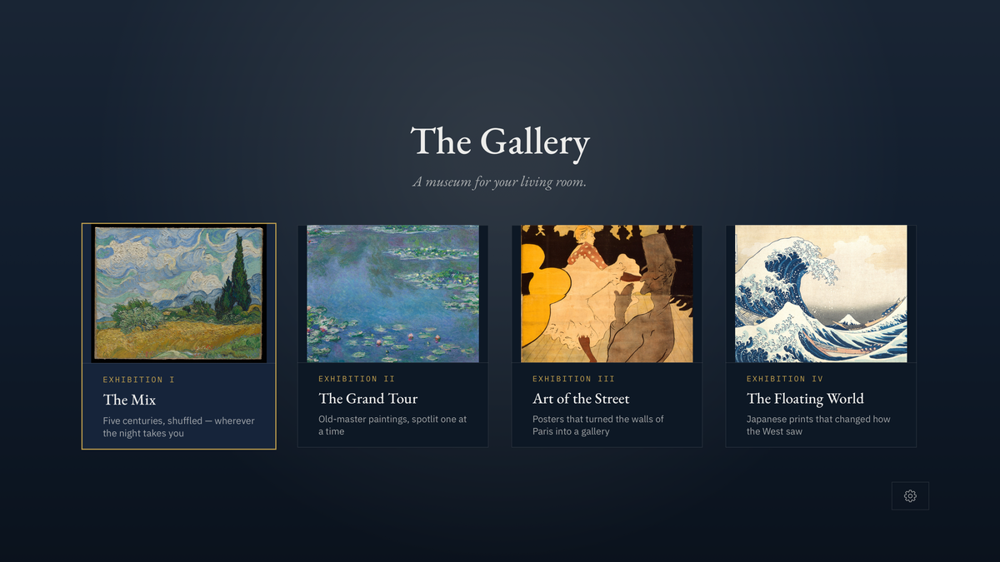

<!-- SDIT Tools · The Gallery -->

# The Gallery

**Art & Music for Apple TV** — a tool from the [San Diego Institute of Technology](https://sandiegotech.org).

A tvOS app that turns your TV into an art gallery: one spotlit, framed artwork at a
time, paired with music from (or near) the moment it was made, with a museum-style
placard you can select to read the full story.

> Part of [**SDIT Tools**](https://sandiegotech.org/tools/) — free, open-source software
> built for focus, privacy, and performance in the age of AI.
> **Free · Open Source · MIT Licensed · No accounts, no feed, no algorithm.**

Platforms: **Apple TV (tvOS)**



## Status — in testing

The Gallery is **currently in testing and not yet on the App Store**. The app builds
and runs today, and TestFlight builds go out to early testers as we polish it toward
release. If you would like to test it, write to
[brandon@sandiegotech.org](mailto:brandon@sandiegotech.org?subject=The%20Gallery%20Testing)
and we'll send you an invite. Blunt feedback and bug reports are the most useful
contribution at this stage. You can also build it from source — see below.

> Note: one music file (`flow-my-tears.mp3`, a 1953 transfer) is excluded from this
> repository for copyright reasons and will be replaced with an openly licensed
> recording before release. The app builds and runs without it.

## Running it

```sh
brew install xcodegen        # once, if you don't have it
xcodegen generate            # regenerates Gallery.xcodeproj from project.yml
open Gallery.xcodeproj       # build & run on an Apple TV simulator or device
```

The project file is generated — edit `project.yml`, not the `.xcodeproj`.

## Using it

- **Home screen** — pick an exhibition: The Mix (everything, shuffled), The Grand
  Tour (old masters), Art of the Street (Belle Époque poster art), The Floating
  World (Japanese woodblock prints).
- **In a room** — the artwork hangs spotlit with its placard beside it.
  - ◀ ▶ on the remote: previous / next piece (by default the room moves on when
    each recording ends)
  - **Select the placard**: full curatorial story + why the music was paired
  - **Play/Pause**: pause or resume the music
  - **Menu**: back

## TestFlight

The project is archive-ready: signing is set to the team `4VSTWG394B` with the
bundle ID `com.sdit.gallery`, the layered tvOS app icon / top shelf / launch
images live in the asset catalog, and `ITSAppUsesNonExemptEncryption` is already
declared. To ship a build:

1. **Once:** create the app record at [App Store Connect](https://appstoreconnect.apple.com)
   → My Apps → "+" → New App → platform tvOS, bundle ID `com.sdit.gallery`.
2. Build the ipa:
   ```sh
   xcodegen generate
   xcodebuild archive -project Gallery.xcodeproj -scheme Gallery \
     -destination 'generic/platform=tvOS' -archivePath build/Gallery.xcarchive \
     CODE_SIGNING_ALLOWED=NO
   xcodebuild -exportArchive -archivePath build/Gallery.xcarchive \
     -exportPath build/export -exportOptionsPlist ExportOptions.plist \
     -allowProvisioningUpdates
   ```
3. Upload:
   ```sh
   xcrun altool --upload-app -f build/export/Gallery.ipa -t appletvos \
     --apiKey GZFDNV8R4C --apiIssuer 69a6de97-6041-47e3-e053-5b8c7c11a4d1
   ```
   (The API key lives at `~/.appstoreconnect/private_keys/`.) Once processing
   finishes, the build appears in App Store Connect → TestFlight — add yourself
   to an internal test group and install via the TestFlight app on the Apple TV.

Bump `CURRENT_PROJECT_VERSION` in [project.yml](project.yml) before each new upload.

## Design

The app follows the SDIT (San Diego Institute of Technology) Founding Charter
design system — the brand guidelines live at `~/Documents/GitHub/San Diego
Tech/Website-Main/brand.html`. The gallery offers three walls, chosen in
Settings: **Ink** (the charter navy — default), **Charcoal** (neutral
near-black), and **Stone** (a muted warm grey for daytime viewing). Dark walls
follow the charter's dark-mode rules — warm paper white at stepped opacities.
Force a wall with the `-wall ink|charcoal|stone` launch argument.
EB Garamond for display, IBM Plex Sans for prose, IBM Plex Mono for tracked
ALL-CAPS eyebrows and metadata (all three embedded, OFL-licensed). Panels are
flat with hairline borders and zero corner radius; focus is shown with a gold
border, not a lift. Motion is the brand's rise reveal (fade + 8pt, 80ms stagger,
ease-out, opacity-only under Reduce Motion). Tokens and shared components are in
[SDITTheme.swift](Gallery/Sources/Views/SDITTheme.swift).

The app icon follows the brand's product-mark rules: a stroke-based mark of a
framed landscape — frame, one line of hills, one sun — in ink on a warm paper
tile. [tools/render_assets.py](tools/render_assets.py) renders it as three
parallax layers (paper / frame / landscape, so the work floats inside its frame
when focused) plus the top shelf and launch images; rerun it to regenerate the
asset catalog.

## Settings

A quiet gear icon in the lobby's bottom-right corner opens three charter-style rows:
**Wall** (ink / charcoal / stone), **Music** (on / off), and
**Pace** (with the music — the default — or 1 / 5 minutes). They persist in UserDefaults
under the same keys the debug launch arguments use, so `-wall stone`,
`-exhibition japan`, and `-openSettings YES` remain available for testing.

## How content works

Everything is driven by [manifest.json](Gallery/Resources/manifest.json) — collections,
artworks, placard text, frame styles, and music pairings. Images live in
`Gallery/Resources/Media/`, tracks in `Gallery/Resources/Music/`. To add a piece, drop
in a JPEG + MP3 and add an entry to the manifest. Frame styles, each chosen to
match the work's era: `gilded` (Impressionist gilt), `baroque` (carved Salon
gold), `dutch` (ebonized black with a gold sight-line), `secession` (flat Klimt
gold), `classic` (dark wood), `modern` (thin black), `float` (ivory mat —
posters/prints), `none` (street art, painted straight on the wall). Unknown
values fall back to `classic`.

### Streaming later (already wired)

`ContentStore.remoteManifestURL` is the single switch: point it at a hosted
`manifest.json` and the app loads content from your server instead of the bundle.
`image` and music `file` fields in a remote manifest can be absolute URLs — both the
image view and the music player already handle remote media. Hosting can be as dumb
as a static folder (GitHub Pages, S3, a $4 VPS): no API needed. The bundled manifest
stays as the offline fallback.

## Content sources

All artwork images are public domain, from the Met Museum Open Access program and
Wikimedia Commons (the Art Institute of Chicago pieces come via Commons). Music is
from the Internet Archive — mostly pre-war 78rpm transfers. One caveat if you ever
distribute the app: the Deller/Dupré "Flow My Tears" transfer is a 1953 recording,
so swap it for an older or openly licensed performance before shipping anything
public. The fetch scripts that built this content set are in `tools/`.

## Ideas for later

- A top-shelf extension surfacing "tonight's exhibition"
- Time-aware exhibitions (calm prints in the morning, posters at night)
- "Save to my collection" + a favorites room
- More rooms: photography (Stieglitz/Atget are public domain), Japanese graphic
  design, Bauhaus posters, NASA photography
- Screensaver-style auto-start after idle
